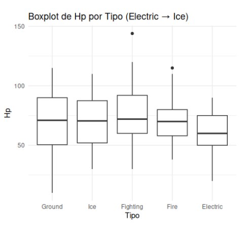
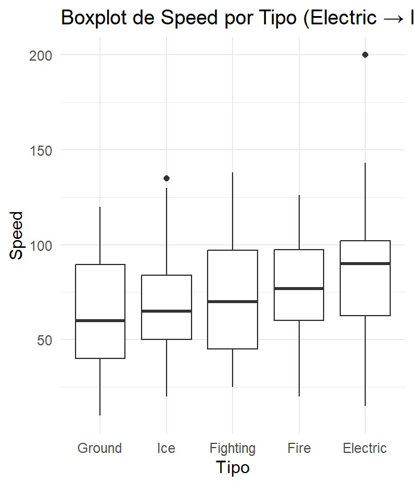

# Pokemon Statistics Analysis

---

# Overview 

This repository contains a statistical analysis of Pokémon data, focusing on descriptive and inferential statistics. The proyect explores how attributes such as **HP** and **Speed** vary across Pokémon types and generations and applies statistical tests to validate differences between groups. 

The dataset contained 1,072 Pokémon, with a focus on four stats variables: type, generation, HP, and speed.  

---

# Authors 

This proyect was developed by Araceli Romero araceliromerozerpa@gmail.com and Daniel Rangel juan.daniel.rangel.avila@gmail.com for the Statistics class of 2025-2, at [UNAM](https://www.unam.mx/), Mexico. 

---

# License 

This proyect is under [GNU General Public License v3.0](https://www.gnu.org/licenses/gpl-3.0.html).

---

# Justification

We use the Pokémon universe as a practical case of study for data science. It transforms the game lore into quantitative insights, applyig statistical methods to answer common questions, and debunk or confirm these. 

---

# Aim

The main objectives of this project are:
- Clean and prepare a raw Pokémon dataset for analysis.
- Perform an exploratory analysis to visualize patterns, trends, and data correlation.
- Formulate and test hypothesis to validate common beliefs about Pokémon strenghts and weaknesses. 
- Use statistical tests like ANOVA, t-tests, Kruskal-Wallis, among others to determine if the observed differences between groups are statistically significant. 
- Visualize through charts, diagrms and, graphics 

---

# Analysis Results 

The distribution showed that Pokémon had an average HP of 70.47, and an average Speed of 68.66. Both variables skewness sugested most types did not follow a normal distribution (HP with a value of 1.77 and Speed with a value of 0.42), therefore only the types Ground, Ice, Fighting, Electric and Fire were used. When comparing these five types, we found Electric(M = 85.94) was the fastest type among them, followed by Fire(M = 75.34), while Ground(M = 62.02) types were the slowest. Regardless Ground, Fighting, and Ice Pokémon showed higher mean HP values (M ≈ 71–74). These  highlight trade-offs between speed and endurance across types.

- HP boxplot 

  

- Speed boxplot 

  

Across the eight generations, Pokemón displayed gradual variability in both HP and Speed. With the third generation showing the highest variability in speed (SD = 31.33), while the eighth generation included Pokémon with the highest maximum speed (200).  

For the **bivariate analysis** five statistically significant variable pairs were identified, including HP–Speed, Attack–Speed, and Attack–Defense. Covariance and Pearson correlation analyses revealed:

- HP–Speed: Weak positive correlation (r = 0.17), suggesting that faster Pokémon tend to have slightly higher HP.

- Attack–Defense: Strong positive covariance, indicating that Pokémon with higher attack often also have a higher defense.

- Speed–Defense: Near-zero covariance, suggesting independence between them, meaning a Pokémon can be both slow and highly defensive, or fast and weaker.

A **regression analysis** was also conducted with Speed as the dependant vaiable and HP as the predicto. The simple linear regression's results indicated a statistically significant but weak positive relationship (β = 0.195, p < 0.001). The model explained only 3.05% of the variance (R² = 0.0305). This implies that HP is not a sufficient predictor of Speed, and other variables play a stronger role in determining Pokémon speed.

Finaly ANOVA tests were applied to compare HP and Speed scross Types and Generations. The results confirmed that differences in both variables across groups were statistically significant, Pokémon characteristics are strongly influenced by their categorical attributes (type and generation in this case).

---

# Programs used  

It was made both in Python and in R, you can find the code in the [Analisis_Pokemon_proyecto.ipynb](https://github.com/Marzerp/Pokemon_Statistics/blob/main/Analisis_Pokemon_proyecto.ipynb) for Pyhton and [AnalisisPokemon.R](https://github.com/Marzerp/Pokemon_Statistics/blob/main/AnalisisPokemon.R) for R. 

For Python:
- **Pandas**
- **Numpy**
- **Matplotlib**
- **Scipy**

For R:
- **Dplyr**
- **Momentsggplot2**
- **Mass**
- **Aiccmodavg**
- **Broom**
- **Ggpubr**
- **Corrplot**
- **Hmisc**
- **Rcolorbrewer**
- **Cluster**
- **Factoextra**
- **Ggpubr**
- **Qqplotr**

